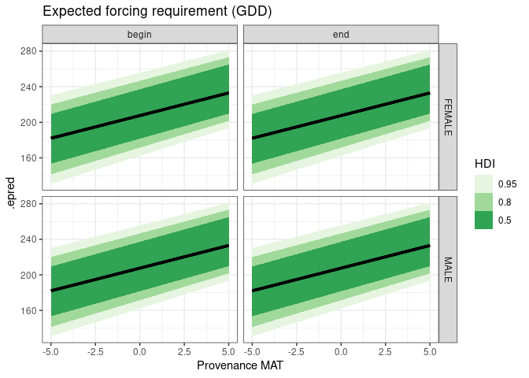

Phenology model prediction examples
================
C. Susannah Tysor
2024-12-29

# modells

`modells.rds` is a list of output from models predicting thermal time
requirements for flowering in\* Pinus contorta\* ssp. *latifolia*. Model
objects were produced by the `brms` package in `R`. There are four
models in total - one each for the start and end of cone receptivity and
pollen shed.

The model objects are provided here for ease of reproducing analyses
associated with
[`scisus/picolaDocThesis`](https://github.com/scisus/picolaDocThesis)
and so that new predictions can be generated by anyone without
re-fitting the models.

Model predictions are in growing degree day forcing units with a base of
5 °C. The predictor variable is the mean annual temperature (in °C) and
site, year, genotype, and tree are included as random effects.

Code used to generate the model may be found in the
[`scisus/picolaModel`](https://github.com/scisus/picolaModel)
repository. Detailed model description and context is available in the
[`scisus/picolaDocThesis`](https://github.com/scisus/picolaDocThesis)
repository.

Predictions can be made using [`tidybayes`
functions](http://mjskay.github.io/tidybayes/reference/add_predicted_draws.html)
or `brms` functions `posterior_linpred`, `posterior_epred`, and
`posterior_predict`.

To predict flowering requirements, only provenance MAT is required.
Factors Year, Tree, Genotype, and Site can also be provided. If
predicting for levels not in the original data
[`scisus/picolaDataFlowering`](https://github.com/scisus/picolaDataFlowering),
you must specify how to sample new levels with the `sample_new_levels`
argument to the prediction function.

## Example use

``` r
# install model object from Zenodo
modells <- readRDS(here::here("model/modells.rds")) # Download from 10.5281/zenodo.14597582 a.k.a. https://zenodo.org/records/14597582
nsamp <- 6000 # downsample
```

### Predict grand mean

Calculate the model expectation for MATs of -5 to 5 degrees. This is the
average predicted forcing requirement ignoring the effects of site,
year, genotype, and tree.

``` r
# make a new dataset with no factors
dat_MATonly <- expand.grid(MAT = c(-5,5),
                      event = c("begin", "end"),
                      Sex = c("FEMALE", "MALE"))

# make predictions excluding factor effects (re_formula = NA)
grandMean_preds <- purrr::map(modells, # predict out of all four models
                     .f = function(x) {tidybayes::add_epred_draws(dat_MATonly,
                                                         object = x,
                                                         re_formula = NA,
                                                         ndraws = nsamp)}) %>%
    bind_rows()

ggplot(grandMean_preds, aes(x = MAT, y = .epred)) +
    stat_lineribbon() +
    scale_fill_brewer(palette = "Greens") +
    theme_bw() +
    facet_grid(Sex ~ event) +
    ggtitle("Expected forcing requirement (GDD)") +
    xlab("Provenance MAT") +
    labs(fill = "HDI")
```

<!-- -->

### Predict new levels

Make forcing unit predictions for a new site, year, genotype, and tree
that includes

- the uncertainty in the MAT effect
- the uncertainty of the variance parameters of the factors
- the uncertainty for individual observations

``` r
dat_newLevels <- expand.grid(MAT = seq(from = -5, to = 5),
                          Year = "newyear",
                          Tree = "newtree",
                          Genotype = "newgenotype",
                          Site = "neworchard",
                          event = c("begin", "end"),
                          Sex = c("FEMALE", "MALE")) %>%
  split(list(.$event, .$Sex))


newLevels_preds <- purrr::map2(dat_newLevels, modells,
                          .f = function(x,y) {tidybayes::add_predicted_draws(newdata = x,
                                                                  object = y,
                                                                  re_formula = NULL,
                                                                  allow_new_levels = TRUE,
                                                                  sample_new_levels = "gaussian", # new groups based on random draws from model N(0, sd_factor)
                                                                  ndraws = nsamp)}) %>%
  bind_rows()

ggplot(newLevels_preds, aes(x = MAT, y = .prediction)) +
    stat_lineribbon() +
    scale_fill_brewer(palette = "Blues") +
    theme_bw() +
    facet_grid(Sex ~ event) +
    xlab("Provenance MAT") +
    ggtitle("New level forcing requirements with uncertainty") +
    labs(fill = "HDI")
```

<!-- -->

### Predict for a mix of new and existing levels

You may wish to predict for a mix of new and existing levels, for
example, if you are working with genotypes (and associated provenance
MATs) and sites used to fit this model, but with new or unknown trees
(ramets) and years. In this case you may wish to sample new levels with
option “uncertainty” instead of “gaussian,” basing the uncertainty for
new levels on existing ones rather than random draws from
$\sigma_{factor_i}$.

``` r
# real provenance MAT and genotype pairs included in building the model
real_dat <- data.frame(MAT = c(3.2, 3.2, 4.8, 6.1), Genotype = c("1460", "1467", "3118", "1536"), Site = rep("Kalamalka", 4))

dat_kal4 <- expand.grid(Year = "newyear",
                          Tree = "newtree",
                          Site = "Kalamalka",
                          event = c("begin", "end"),
                          Sex = c("FEMALE", "MALE")) %>%
    dplyr::full_join(real_dat, relationship = "many-to-many") %>%
    split(list(.$event, .$Sex))

kal4_preds <- purrr::map2(dat_kal4, modells, # predict out of all four models
                     .f = function(x, y) {tidybayes::add_epred_draws(x,
                                                         object = y,
                                                         re_formula = NULL,
                                                         allow_new_levels = TRUE,
                                                         sample_new_levels = "uncertainty",
                                                         ndraws = 3000)}) %>%
    bind_rows() 


ggplot(kal4_preds, aes(x = .epred, y = MAT, colour = Genotype, fill = Genotype)) +
    stat_halfeye(alpha = 0.7) +
    scale_colour_brewer(type = "qual", palette = "Dark2") +
    scale_fill_brewer(type = "qual", palette = "Pastel2") +
    theme_bw() +
    facet_grid(Sex ~ event) +
    ylab("Provenance MAT") +
    ggtitle("Expectation for four genotypes at Kalamalka")
```

<!-- -->

[Andrew Heiss](https://www.andrewheiss.com/) has written some clear and
practical guides on predicting from Bayesian models using `brms` and
`tidybayes`:

- [the differences between posterior predictions, the expectation of the
  posterior predictive distribution, and the posterior of the linear
  predictor](https://www.andrewheiss.com/blog/2022/09/26/guide-visualizing-types-posteriors/).
- predictions from a mulitilevel Bayesian model with [an especially
  useful table describing how function arguments relate to prediction
  goals](https://www.andrewheiss.com/blog/2021/11/10/ame-bayes-re-guide/#overall-summary-of-different-approaches).
