Phenology model conceptual analysis
================
C. Susannah Tysor
2021-08-24

# Conceptual Analysis

This section outlines and justifies some of the choices made in the
modeling process, especially regarding priors. Data used to make these
choices includes - corrected daily climate dataset for 1945-2012
described in \[Site weather data\]

I have a record of days that lodgepole pine were recorded flowering or
not flowering during the general flowering period. Trees were observed
for several years at several sites and trees were not observed every day
and the start or end of the flowering period may have been missed.

The flowering observations ($f_i$) were simplified to three states -
before flowering, flowering, past flowering. States are used to infer
two of four events (1-last day before flowering, 2-first day flowering,
3-last day flowering, 4-first day past flowering). The amount of forcing
accumulated at each event day was calculated as growing degree days with
a 5 degree threshold.

I want to know how much forcing after January 1 must accumulate for
events 2 and 3 - the flowering state - to occur.

$f_i \sim \mathcal{N}(\phi_i, \sigma)$

I wish to account for several kinds of structure in the data:

- year of observation
- site where tree was grown
- genotype of the tree
- individual tree

as well as censoring and variation due to provenance climate summarised
at MAT

So

$\phi_i = \mu + \beta MAT_i + delta_{site,i} + \delta_{year,i} + \delta_{genotype,i} + \delta_{tree,i}$

where $\mu$ is the average amount of forcing it takes for a tree to
reach an event and the $\delta$s describe how much each level in each
factor (site, prov, year, genotype) is offset from the population mean
amount of forcing required to reach the event.

I can account for different types of censoring by modifying the
likelihood.

I want priors on parameters to be regularizing and weakly informative.

## Define observational space

There are several thousand observations of each event. Each observation
is the amount of forcing units accumulated when the event occurs for a
given tree.

So, how much forcing is accumulated over the year? I use the sites in my
study and all possible years in my climate dataset (1945-2012).

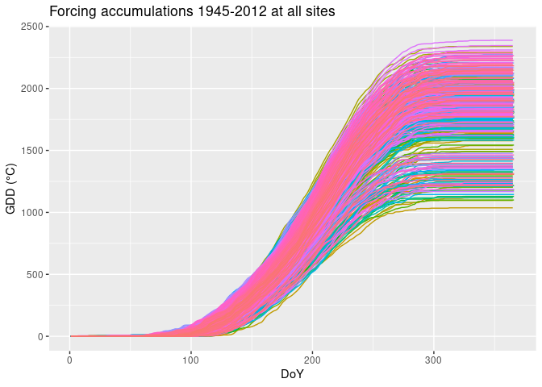

What are reasonable amounts of forcing? Lodgepole in BC flower in late
spring. Flowering occurs in BC, according to Owens (2006)in late May and
June. I will generously use May 01 to June 30 as dates to consider.

<figure>
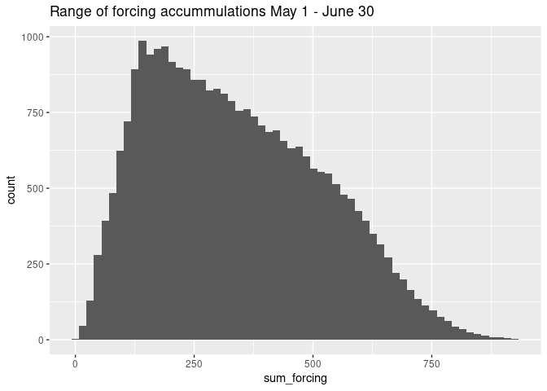
<figcaption aria-hidden="true">Histogram of forcing accumulations May 1
to June 30 at all sites 1945-2012</figcaption>
</figure>

<figure>
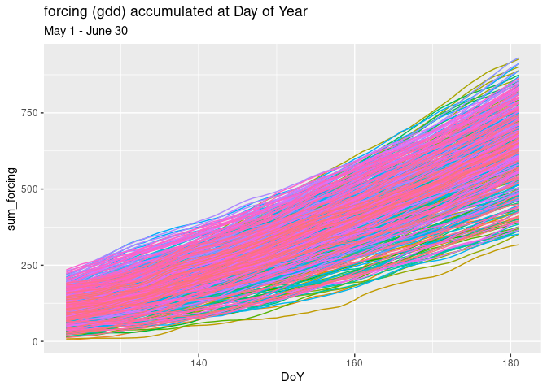
<figcaption aria-hidden="true">Day of Year of forcing accumulations May
1 to June 30 showing increase through time.</figcaption>
</figure>

    ## [1]   5.243661 501.812819

    ## [1]  38.72413 930.28143

Flowering is more likely to start in the earlier part of the date range
and end in the later part of the date range. The range of forcing
accumulation for May is 5 - 502 GDD. The range of forcing accumulation
from May 15 to June 30 is 39 - 930 GDD.

Each event is associated with a year, site, genotype, and tree. There
are 16 years, 7 sites, 259 genotypes, and 748 individual trees
(genotypes).

# Model development

$f_i$ are the observations of accumulated forcing. They are positive and
continuous and should be between about 0 and 1000 GDD.

$f_i$’s value can be modeled as coming from a distribution with a mean
forcing accumulation ($\phi_i$) and standard deviation $\sigma$ that
represents our uncertainty in the observation - how good our temperature
measurements are, how good the forcing unit accumulation function is,
and whether the event was observed on the correct day, etc.

## Residual standard deviation

$\sigma$ could potentially be relatively large because of irregular
sampling and compounding errors through censoring, multiple observers,
and errors in accumulated forcing. I think an extreme upper limit is
probably about 2 weeks of forcing.

The amount of forcing that can accumulate over any two week period
between January and June can be quite large - 99th percentile is 193.

``` r
ggplot(fortforc, aes(x=fortforc)) +
  geom_histogram(binwidth = 5) +
  ggtitle("Forcing accumulation over 14 day periods Jan-Jun") +
  geom_vline(xintercept = fextreme)
```

    ## Warning: Removed 6188 rows containing non-finite outside the scale range
    ## (`stat_bin()`).

<figure>
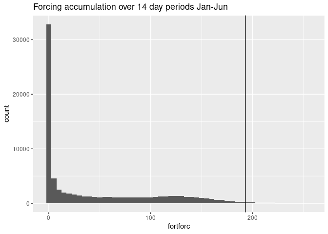
<figcaption aria-hidden="true">Histogram of forcing accumulations over
14 day periods January-June. Vertical line at 99th
percentile</figcaption>
</figure>

The sd required to obtain these values in a normal distribution or the
$\nu$ in a student t’s distribution is:

``` r
# normal
pnorm(fextreme, 0, sd=70) # sd to cap at extreme #50 prob fine too
```

    ##       99% 
    ## 0.9971152

``` r
hist(rnorm(1000, 0, sd=70), breaks=60) 
```

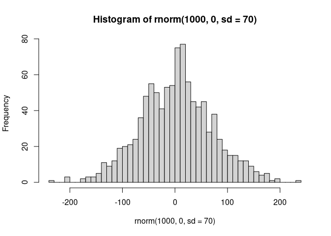<!-- -->

``` r
# pnorm(feextreme, 0, sd = 40)
# hist(rnorm(1000, 0, sd = 40))

#student
# pt(fextreme, 1)
# hist(rt(1000, 1), breaks = 50)
```

And distributions that produce these standard deviations, for sampling
sigma are

``` r
pnorm(70, 0, 30) 
```

    ## [1] 0.9901847

``` r
pt(40, 1)
```

    ## [1] 0.9920439

``` r
hist(rnorm(1000, 0, 30))
```

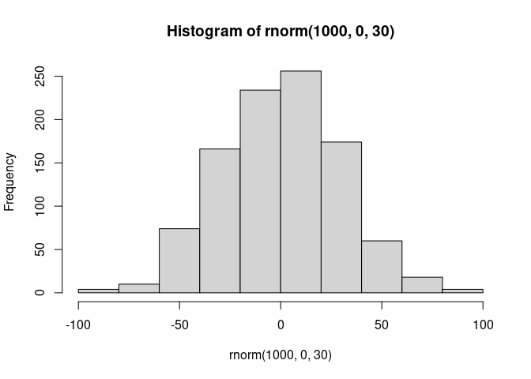<!-- -->
So,

$f_i ~ \mathcal{N}(\phi_i, \sigma)$

$\sigma \sim |\mathcal{Normal}(0, 50)|$

$\phi_i$ is a function of $\mu$ and the $\delta$ offsets.

## mu

$\mu$ represents the population average for forcing required to achieve
the flowering event of interest. I think I could get away with using the
same prior for both begin and end events. Since forcing accumulation is
always positive and the overall distribution across reasonable ranges is
strongly right skewed, I think a gamma distribution is an appropriate
prior.

### prior phenology data

We actually have reports from Nilsson 1981 and Owens 2006 on how much
forcing it takes for lodgepole to flower.

``` r
nilsson <- read.csv(here::here('inputs/Nilsson1981/swedish-pollen-timeseries.csv'), header=TRUE) 
hist(nilsson$sum_forcing)
```

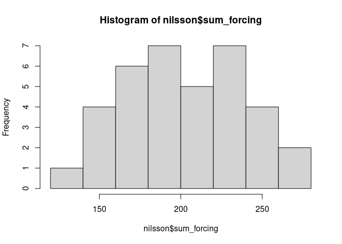<!-- -->

With a mean of 203.3055556, Nilsson’s data differs quite a lot from the
report of 500 GDD in Owens 2006. As Owens 2006 doesn’t provide any data
to back up its report of 500 GDD, I think it should be downweighted in
prior construction.

``` r
meanforcing <- weighted.mean(x = c(500, mean(nilsson$sum_forcing)), w = c(0.10, 0.90)) #downweight Owens data, but don't exclude

# Thanks S. Kurz https://discourse.mc-stan.org/t/setting-prior-on-interaction-term/12801/4 and Kruschke https://bookdown.org/content/3686/hierarchical-models.html#a-realistic-model-with-mcmc 
gamma_s_and_r_from_mean_sd <- function(mean, sd) {
  if (mean <= 0) stop("mean must be > 0")
  if (sd   <= 0) stop("sd must be > 0")
  shape <- mean^2 / sd^2
  rate  <- mean   / sd^2
  return(list(shape = shape, rate = rate))
}

phenology_gammapars <- gamma_s_and_r_from_mean_sd(meanforcing, 2*sd(nilsson$sum_forcing)) # double the sd on nilsson to weaken the prior. combine nilsson and owens mean. No sd info in Owens 2006 to incorporate.
phenology_gammapars
```

    ## $shape
    ## [1] 10.26034
    ## 
    ## $rate
    ## [1] 0.04404051

``` r
#gamma_s_and_r_from_mean_sd(mean(nilsson$sum_forcing), 2*sd(nilsson$sum_forcing)) #excluding owens entirely
#hist(rgamma(1000, shape = 7.8, rate = 0.038), breaks = 50) # no owens
hist(rgamma(1000, shape = phenology_gammapars$shape, rate = phenology_gammapars$rate), breaks = 50) #with owens
```

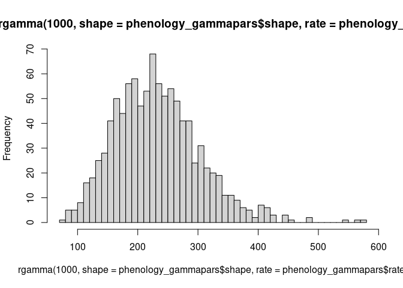<!-- -->

``` r
pgamma(500, shape = phenology_gammapars$shape, rate = phenology_gammapars$rate) # double check that owens report is still within the realm of possibility
```

    ## [1] 0.9981243

### prior climate data

I think I’d like to try being a little less informative with my priors,
however, and rely on seasonal weather data instead.

``` r
ffperiod <- dplyr::filter(forcing, DoY > may01 & DoY < jun30, Site == "PGTIS") # choosing a northern site bc southern sites are early and forcing starts to accumulate *really* fast in June in the south - well after they're done flowering
range(ffperiod$sum_forcing)
```

    ## [1]   5.243661 638.513063

``` r
ffp99 <- quantile(ffperiod$sum_forcing, 0.99)

forcing_gammapars <- gamma_s_and_r_from_mean_sd(mean(ffperiod$sum_forcing), sd(ffperiod$sum_forcing))
forcing_gammapars
```

    ## $shape
    ## [1] 2.714741
    ## 
    ## $rate
    ## [1] 0.01249921

Because forcing tends to accumulate very quickly shortly after flowering
as summer begins, this is a little unfair (in a conservative direction)
as a prior, pushing the tail out further than is probably reasonable.

``` r
hist(rgamma(1000, shape = forcing_gammapars$shape, rate = forcing_gammapars$rate), breaks = 50)
```

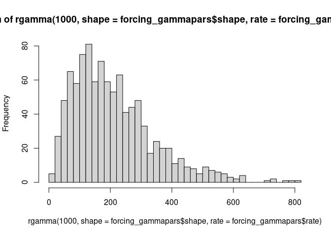<!-- -->

``` r
pgamma(ffp99, shape = forcing_gammapars$shape, rate = forcing_gammapars$rate) # a little low
```

    ##       99% 
    ## 0.9731211

Honestly anything over 500 would be pretty surprising, so if the model
is fussy, pull the tail in with a higher rate or switch to the nilsson &
owens derived prior.

## delta

The $\delta$ effects are modeled as offsets from $\mu$, thus the
superpopulation mean must be 0. Individual effects, however, may vary by
$\sigma_{factor}$

A flowering period of 2 weeks for a population would be very long and a
flowering period of a week very long for an individual tree, so an
effect ($\delta$) that changed the timing of flowering by even a few
days would be meaningful. An delta that shifted flowering by 1 weeks
would be quite extreme. How much forcing can accumulate in 1 week prior
to an event?

``` r
week_forcing <- janjun %>%
  group_by(Site, Year) %>%
  reframe(sum_forcing_week = zoo::rollsum(forcing, 7))

ggplot(week_forcing, aes(x=sum_forcing_week)) +
  geom_histogram() +
  ggtitle("Forcing accumulation over 1 week periods from January 1 to June 30") +
  geom_vline(xintercept = mean(week_forcing$sum_forcing_week))
```

    ## `stat_bin()` using `bins = 30`. Pick better value with `binwidth`.

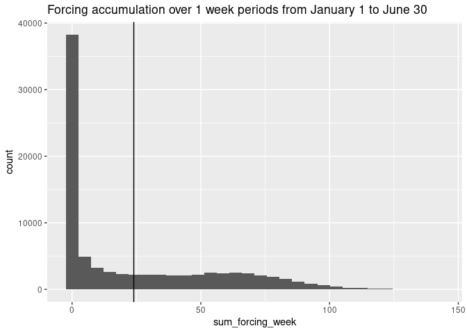<!-- -->

``` r
# 90th percentile of forcing that can accumulate in a week
wextreme <- quantile(week_forcing$sum_forcing_week, .99) # because forcing accumulates so much faster at the end of june when flowering is quite unlikely, capping at 90%

pnorm(wextreme, mean=0, sd=45) # what sd caps at extreme forcing accumulation
```

    ##       99% 
    ## 0.9894188

103.7283056 would be a very extreme delta and it would be in the 99th
percentile of a normal distribution with mean 0 and standard deviation
45. So to obtain a $\sigma$ of 45,

``` r
pnorm(30, mean = 0, sd=12)
```

    ## [1] 0.9937903

``` r
pt(45, 1)
```

    ## [1] 0.9929276

$\delta_{cluster} \sim \mathcal{N}(0,\sigma_{cluster})$

$\sigma_{cluster} \sim \mathcal{N}(0, 18)$

``` r
hist(rnorm(1000, mean=0, sd=12), breaks=50) 
```

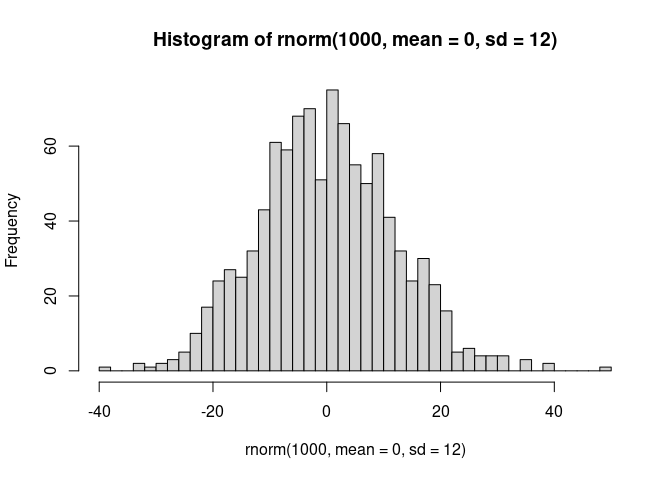<!-- -->

I’ve stuck with half normals because while genotype and genotype have
hundreds of levels, Site only has 7 and year only 16.

## beta

Beta sampling distribution must include 0 as we don’t know if there’s an
effect and it’s centered on 0 because I don’t have any reason to believe
an effect would be positive or negative. How wide its sampling
distribution will be depends realistic forcing ranges and MAT. MAT at my
sites ranges from -0.7 to 6.8°C. If only provenance climate controlled
GDD requirements, then maximum size of beta is the maximum accumulated
forcing difference between sites divided by the MAT range.

``` r
maxsitediff <- forcing %>%
  filter(DoY == 181) %>%
  select(Year, Site, sum_forcing) %>%
  summarise(maxdiff = diff(range(sum_forcing))) %>%
    pull()
```

The maximum difference between sites is about 613.1769061 GDD and the
temperature difference between provenances is about 8 degrees, so, if
MAT explained the entire GDD required, $\beta$ would be about
76.6471133.

But that’s a very unrealistic assumption based on everything we know
about spring phenology - and the experience of generalized overlap in
the seed orchards. I think even 20 would be a shocking result.

``` r
sdx = 20
pnorm(50, mean = 0, sd = sdx)
```

    ## [1] 0.9937903

``` r
hist(rnorm(1000, 0, sdx))
```

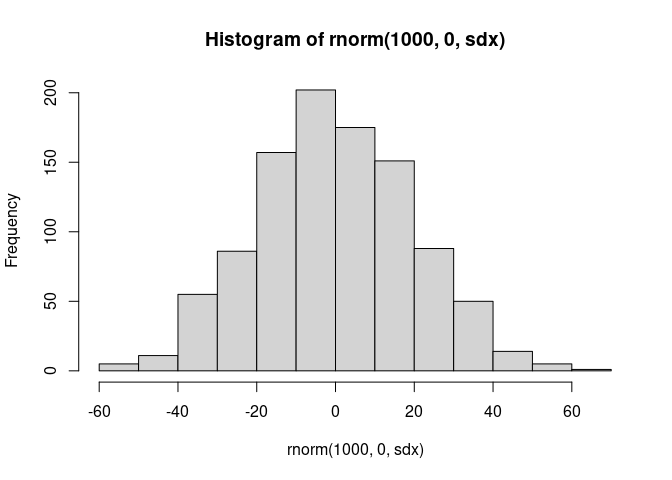<!-- -->

## Centering

Factors that have a lot of levels all with limited data, like genotype,
will probably sample best if non-centered.

Some of my factors are very unbalanced with some levels very well
represented and others not and could benefit from partial decentering.
However, brms automatically non-centers everything. If it works, then
don’t worry here.
